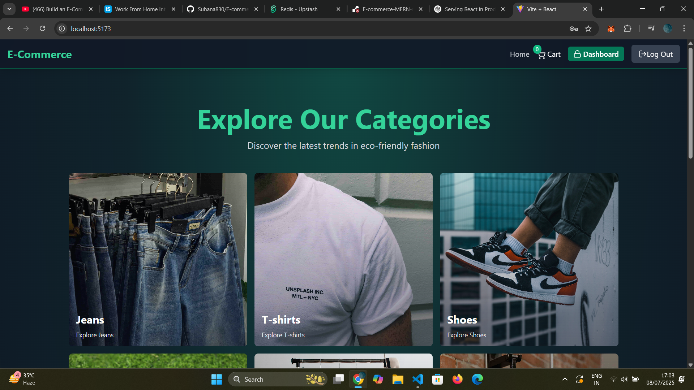
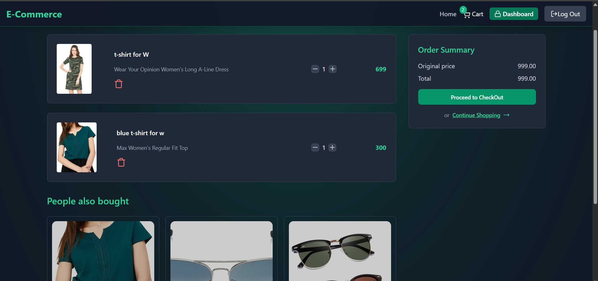
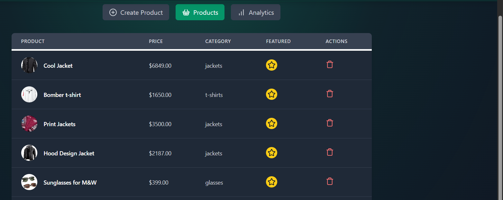
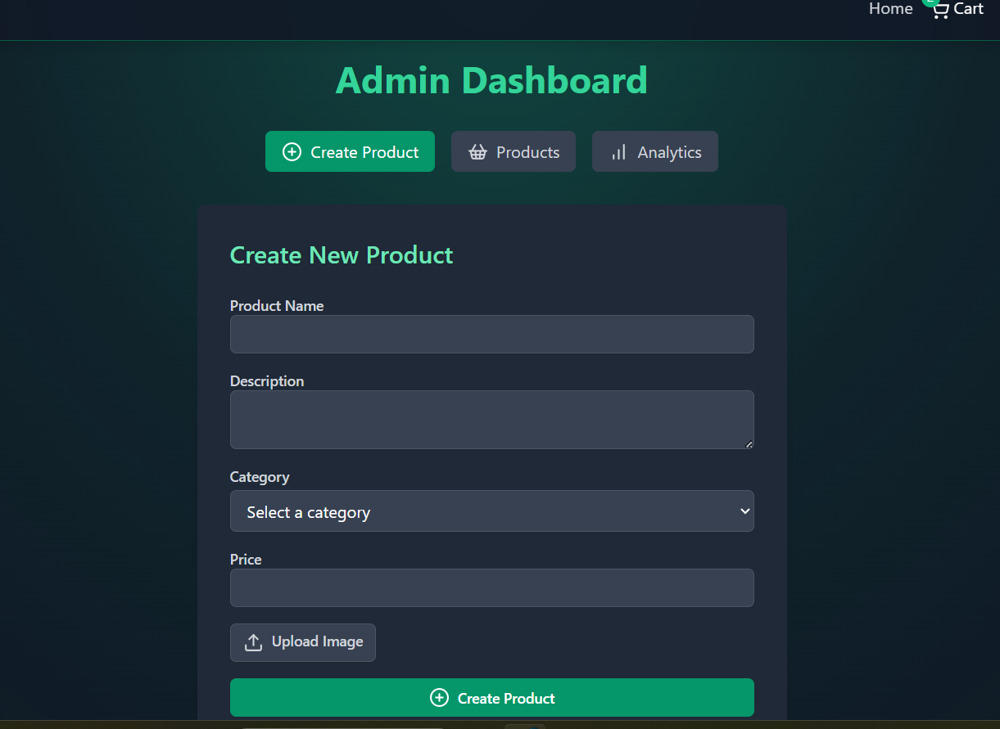

# 🛍️ E-Commerce MERN + Redis Project

A full-featured E-Commerce web application built using the **MERN stack** (MongoDB, Express.js, React.js, Node.js) with advanced features including **JWT authentication**, **Cloudinary image upload**,  **Redis caching**, and an intuitive **admin dashboard** .

---

## 🚀 Features

### ✅ User Features
- 📝 User Signup & Login with secure JWT tokens
- 👤 Profile Management
- 🛒 Add to Cart, Remove from Cart


### 🛠️ Admin Features
- 📦 Create, Update, Delete Products
- ⭐ Mark Products as Featured
- 🔒 Admin-protected routes

---

## 🌟 Tech Stack

| Layer         | Technology                    |
|--------------|-------------------------------|
| Frontend     | React.js, TailwindCSS, Zustand, Vite |
| Backend      | Node.js, Express.js           |
| Database     | MongoDB                       |
| Auth         | JWT (Access & Refresh Tokens) |
| Media Upload | Cloudinary                    |
| Caching      | Redis via Upstash             |

---

## ⚙️ Environment Variables

Create a `.env` file in the root with the following keys:

```env
PORT=5000
MONGO_URL=your_mongodb_connection_string
UPSTASH_Redis_Client_URL=your_upstash_redis_url
ACCESS_TOKEN_SECRET=your_access_token_secret
REFRESH_TOKEN_SECRET=your_refresh_token_secret

CLOUDINARY_CLOUD_NAME=your_cloudinary_cloud_name
CLOUDINARY_APIKEY=your_cloudinary_api_key
CLOUDINARY_SECRET=your_cloudinary_secret

CLIENT_URL=http://localhost:5173
NODE_ENV=development
```

---

## 💻 Installation & Setup

### 1. Clone the repo

```bash
git clone https://github.com/Suhana830/E-commerce-MERN-redis.git
cd E-commerce-MERN-redis
```

### 2. Backend

```bash
cd backend
npm install
npm run dev
```

### 3. Frontend

```bash
cd frontend
npm install
npm run dev
```

---

## 🔐 Authentication

- Secure JWT-based 
- Role-based access control for admin routes

---

## 🧾 Screenshots

### 🏠 Home Page  


### 🛒 Cart Page  


### ⭐ Featured Products  


### 🧑‍💼 Admin Panel  


---


## 🙋‍♀️ Author

**Suhana Gupta**  

🌐 GitHub: [Suhana830](https://github.com/Suhana830)

---

